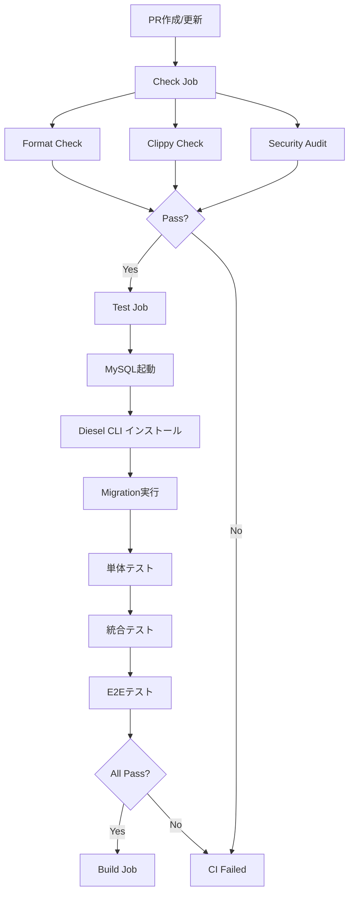

# CI Testing Environment - ガードレールとしてのCI

このドキュメントは、onsen_tabiプロジェクトのCI（継続的インテグレーション）テスト環境について説明します。

## 概要

このプロジェクトでは、コード品質を保証するため に**多層的なガードレール**を実装しています：

1. **ローカル開発時**: Pre-commitフック
2. **プルリクエスト時**: GitHub Actions CI
3. **デプロイ前**: 追加の統合テスト

## CI ワークフローの構成

### 1. CI Workflow (`.github/workflows/ci.yml`)

包括的なテストとチェックを実行するメインのCIワークフロー。

#### Jobs

1. **Code Quality Checks (`check`)**
   - コードフォーマットチェック (`cargo fmt`)
   - Lintチェック (`cargo clippy`)
   - セキュリティ脆弱性チェック (`cargo audit`)

2. **Run Tests (`test`)**
   - MySQL 8.0サービスを使用
   - 単体テスト実行
   - 統合テスト実行（データベース接続）
   - E2Eテスト実行（アプリケーションレベル）

3. **Build Release (`build`)**
   - リリースビルドの作成
   - バイナリのアーティファクト保存

4. **Migration Check (`migration-check`)**
   - マイグレーションファイルの構造チェック
   - up.sql/down.sqlの存在確認

5. **AI Guardrail Checks (`guardrail-check`)**
   - アーキテクチャ違反の検出
   - セキュリティ問題の早期発見
   - unwrap()使用の警告

### 2. Rust Workflow (`.github/workflows/rust.yml`)

シンプルな単体テストとカバレッジ測定のためのワークフロー。

#### Jobs

1. **Test**
   - ビルド
   - 単体テスト（データベース不要）
   - カバレッジ測定（Codecov）

2. **Build**
   - Dockerイメージのビルド・プッシュ（mainブランチのみ）

## テストの種類と実行環境

### 単体テスト（Unit Tests）
- **実行環境**: ローカル・CI両方
- **データベース**: 不要
- **実行コマンド**: `cargo test`
- **テスト数**: 126
- **カバレッジ対象**: ドメインロジック、ビジネスルール

### 統合テスト（Integration Tests）
- **実行環境**: ローカル・CI両方
- **データベース**: MySQL 8.0が必要
- **実行コマンド**: `cargo test -- --ignored`
- **テスト数**: 27
  - controller_tests: 10
  - repository_tests: 12
  - e2e_app_tests: 5
- **カバレッジ対象**: API層、データベース層、アプリケーション全体

### サーバーE2Eテスト（Server E2E Tests）
- **実行環境**: ローカルのみ（手動実行）
- **要件**: 実際のHTTPサーバーが起動している必要
- **実行方法**:
  ```bash
  # ターミナル1: サーバー起動
  cargo run
  
  # ターミナル2: テスト実行
  cargo test --test e2e_server_tests -- --ignored
  ```
- **テスト数**: 8
- **カバレッジ対象**: 実際のHTTPリクエスト、エンドツーエンドフロー

## CI環境でのテスト実行フロー

### Pull Requestトリガー時



### MySQL サービスの設定

```yaml
services:
  mysql:
    image: mysql:8.0
    env:
      MYSQL_ROOT_PASSWORD: password
      MYSQL_DATABASE: onsen_tabi_test
    ports:
      - 3306:3306
    options: >-
      --health-cmd="mysqladmin ping"
      --health-interval=10s
      --health-timeout=5s
      --health-retries=3
```

## ガードレールとしてのCI

### 1. 自動品質チェック

**目的**: コードの品質を自動的に保証し、レビュー負荷を軽減

- ✅ フォーマット統一（`cargo fmt --check`）
- ✅ Lint警告・エラーの検出（`cargo clippy`）
- ✅ 全テストの実行（126単体 + 27統合）
- ✅ セキュリティ脆弱性の早期発見

### 2. アーキテクチャ保護

**目的**: Clean Architectureの原則を守り、技術的負債の蓄積を防ぐ

```bash
# Domain層がInfrastructure層に依存していないかチェック
if grep -r "use crate::infrastructure" src/domain/; then
  echo "❌ Architecture violation"
  exit 1
fi
```

### 3. セキュリティガードレール

**目的**: 機密情報の漏洩を防ぎ、セキュリティリスクを最小化

- ハードコードされたシークレットの検出
- 依存関係の脆弱性スキャン（`cargo audit`）
- unwrap()の過度な使用の警告

### 4. マイグレーション安全性

**目的**: データベーススキーマ変更の安全性を保証

- `up.sql`と`down.sql`のペア存在チェック
- マイグレーションの自動実行・検証

## CI失敗時の対処法

### Format Check Failed

```bash
# ローカルで修正
cargo fmt

# 確認
cargo fmt --check
```

### Clippy Check Failed

```bash
# 警告・エラーを確認
cargo clippy --all-targets --all-features

# 修正後、再度確認
cargo clippy -- -D warnings
```

### Test Failed

```bash
# 失敗したテストを特定
cargo test

# 統合テストの場合
cargo test -- --ignored

# 特定のテストのみ実行
cargo test <test_name> -- --ignored
```

### Migration Failed

```bash
# マイグレーションファイルを確認
ls -la migrations/

# up.sql と down.sql が両方存在するか確認
# 手動でマイグレーション実行
DATABASE_URL=$TEST_DATABASE_URL diesel migration run
```

## ローカル開発でのガードレール

### Pre-commit フック

コミット前に自動実行される品質チェック：

```bash
# インストール
make install-hooks

# 手動実行
.git/hooks/pre-commit
```

**チェック内容**:
1. ✅ フォーマットチェック
2. ✅ Clippyチェック
3. ✅ 単体テスト
4. ✅ 統合テスト（DB起動時）
5. ⚠️ セキュリティ監査
6. ✅ マイグレーションファイルチェック
7. ✅ ガードレール違反チェック

### ローカルでのCI環境再現

```bash
# 1. すべての品質チェック
make check

# 2. テストの実行
cargo test              # 単体テスト
cargo test -- --ignored # 統合テスト

# 3. セキュリティ監査
cargo audit
```

## ベストプラクティス

### 開発フロー

1. **コード変更前**
   ```bash
   # 最新のmainを取得
   git checkout main
   git pull origin main
   ```

2. **機能開発中**
   ```bash
   # こまめにローカルテスト
   cargo test
   
   # 変更後は統合テストも
   cargo test -- --ignored
   ```

3. **コミット前**
   ```bash
   # すべてのチェックを実行
   make check
   
   # Pre-commitフックが自動実行される
   git commit -m "feat: 新機能の実装"
   ```

4. **PR作成後**
   - CI実行結果を確認
   - 失敗した場合は速やかに修正
   - レビュー前にCI成功を確保

### テストの書き方

#### 単体テスト
```rust
#[cfg(test)]
mod tests {
    use super::*;

    #[test]
    fn test_business_logic() {
        // Given
        let input = create_test_data();
        
        // When
        let result = process(input);
        
        // Then
        assert_eq!(result, expected);
    }
}
```

#### 統合テスト（データベース）
```rust
#[test]
#[ignore] // CIで実行するため
fn test_database_operation() {
    let mut conn = establish_test_connection().unwrap();
    
    conn.test_transaction::<_, Error, _>(|conn| {
        // Given
        let test_data = create_test_data();
        
        // When
        let result = repository::save(conn, test_data);
        
        // Then
        assert!(result.is_ok());
        Ok(())
    })
}
```

## トラブルシューティング

### CI が常に失敗する

**確認事項**:
1. ローカルで`make check`が成功するか
2. `cargo test -- --ignored`が成功するか
3. ブランチが最新のmainから作成されているか

### MySQLサービスが起動しない

**原因**: ヘルスチェックの失敗

**対処法**:
```yaml
# ci.ymlのhealth-cmd設定を確認
options: >-
  --health-cmd="mysqladmin ping"
  --health-interval=10s
  --health-timeout=5s
  --health-retries=3
```

### Diesel CLIのインストール失敗

**原因**: 依存関係の競合

**対処法**:
```yaml
# バージョン固定と--locked フラグを使用
cargo install diesel_cli --version 2.1.1 --no-default-features --features mysql --locked || true
```

### テストのタイムアウト

**原因**: データベース接続の遅延

**対処法**:
```yaml
# MySQL待機処理を追加
- name: Wait for MySQL
  run: |
    for i in {1..30}; do
      if mysqladmin ping -h 127.0.0.1 -P 3306 -u root -ppassword; then
        echo "MySQL is ready"
        break
      fi
      sleep 2
    done
```

## CI メトリクス

### 目標値

| メトリクス | 目標 | 現状 |
|----------|------|------|
| テスト成功率 | 100% | 監視中 |
| CI実行時間 | < 10分 | ~8分 |
| カバレッジ | > 70% | 測定中 |
| Clippy警告 | 0 | 0 |

### モニタリング

- GitHub Actions実行履歴: https://github.com/konabe/onsen_tabi/actions
- Codecovレポート: https://codecov.io/gh/konabe/onsen_tabi

## まとめ

このCI環境は以下を保証します：

✅ **品質保証**: すべてのコードが品質基準を満たす  
✅ **セキュリティ**: 脆弱性の早期発見と対応  
✅ **アーキテクチャ**: 設計原則の遵守  
✅ **リグレッション防止**: 既存機能の破壊を防ぐ  
✅ **開発効率**: 自動化による手作業の削減  

これらのガードレールにより、安心してコードを書き、レビューでき、デプロイできる環境を提供しています。

---

最終更新: 2025-11-07
